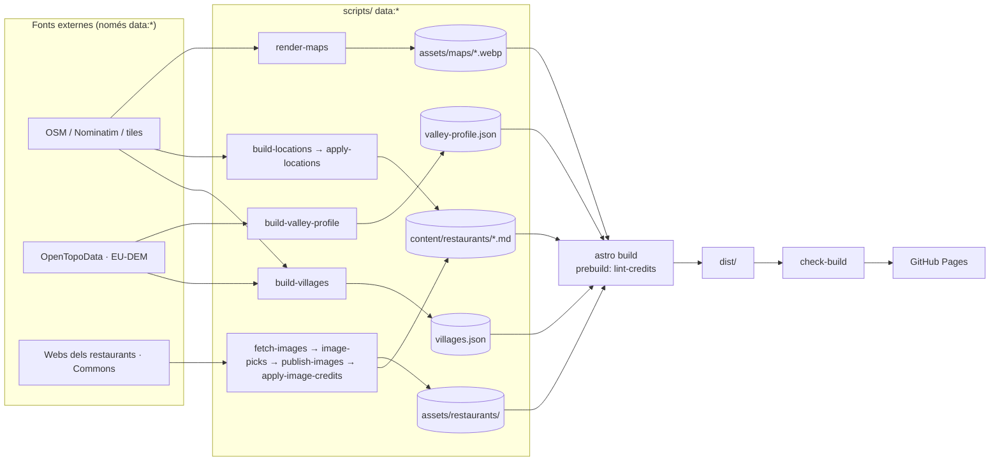

# Arquitectura

Com està fet Cota de tast. Explica *com* funciona; les regles que se'n desprenen són a
[principles.md](principles.md), el perquè de cada tria a [decisions.md](decisions.md), la
superfície de seguretat a [security.md](security.md) i la feina oberta a
[tasks.md](tasks.md). Quan el codi i aquest fitxer no quadren, el codi mana i aquest fitxer
té un bug.

## Forma

Lloc estàtic amb **Astro 7** (`output: 'static'`, `build.format: 'directory'`), sense
framework de client: l'únic JS és el filtre del directori, el commutador de tema i el
`ClientRouter` d'Astro. 79 pàgines: portada, directori, 44 fitxes, pobles, cuines i
`/credits`. Node 24 (`mise.toml`). Es publica a GitHub Pages amb domini propi
(`cerdanya.soms.cat`, `public/CNAME`) i se serveix a l'arrel, sense `base`.

Les dades es fabriquen **fora del build**, amb scripts `data:*` que consulten API externes i
en commitegen la sortida. El build només llegeix fitxers del repo.



## Mòduls

```
src/
  content/restaurants/*.md   Font de veritat de cada fitxa (frontmatter + prosa)
  content.config.ts          Esquema Zod; valida taxonomies i crèdits d'imatge
  data/taxonomy.ts           Vocabularis tancats (cuines, ocasions, serveis, preus)
  data/villages.json         Coordenades i altitud de cada poble  ← build-villages.mjs
  data/valley-profile.json   Perfil real del terreny + esperons   ← build-valley-profile.mjs
  data/map-source.json       Crèdit únic dels 44 mapes d'OSM
  data/brand.json            El senyal (carena, base, gruix), per a capçalera i icones
  assets/maps/<slug>.webp    El mapa de cada fitxa                ← render-maps.mjs
  data/dishes.ts             Els vuit plats de la portada: termes de cerca i foto
  data/site-images.json      Crèdits de les fotos que no són de cap fitxa
  lib/restaurants.ts         Ordenació per cota, agrupacions, veïns
  lib/dishes.ts              Resol plat → cases que el fan, franja de cota i foto
  lib/site-images.ts         site-images.json → ImageMetadata (peta si falta el fitxer); socialCrop()
  lib/maps.ts                Mapa de cada fitxa, enllaç a OSM i enllaç a Google Maps
  lib/structured-data.ts     JSON-LD i les funcions de ruta (restaurantPath, villagePath…)
  layouts/BaseLayout.astro   <head> únic: capes CSS, metadades, tema, ClientRouter, analítica
  components/                ValleySection (el tall), RestaurantCard, FilterBar, PhotoCredit…
  styles/                    tokens.css i base.css globals; la resta, per pàgina
scripts/                     data:* (fora del build), lint-credits i check-build
data/                        Manifests i tries (commitejats); cache/, candidates/, tiles/ ignorats
public/                      CNAME, robots.txt, favicons (generats)
```

## El tall de la vall (`ValleySection`)

Secció longitudinal real del terreny, no una línia decorativa.

- **Dos eixos.** El principal va de Martinet a Font-Romeu (39,75 km, `meta.lengthKm`).
  L'esperó de la vall de Lles (`TRIBUTARIES` a `build-valley-profile.mjs`, clau
  `tributaries` al JSON) hi desemboca al km 0 i el dibuix s'hi plega: arrenca a Lles
  (1.470 m), baixa a Martinet (980 m) i remunta la Cerdanya. La polilínia d'un esperó
  s'ordena des de la confluència cap enfora, i el script peta si hi baixa més de 20 m en
  pujar: vol dir que la recta ha creuat una carena. Un poble cau a l'esperó si hi és més a
  prop que de l'eix; l'empat se'l queda l'eix (Martinet *és* la confluència). `densify()`
  no emet el vèrtex final i a l'esperó s'hi afegeix a mà.
- **Tres capes mesurades.** A cada mostra de l'eix, `swathOf()` mesura el terreny en
  perpendicular cada 250 m fins a 5 km a banda i banda (`SWATH_M`), i en guarda el màxim a
  1,5 km (`shoulderEle`, vessant) i a 5 km (`crestEle`, carena). ±5 km surt d'Alp, el poble
  més lluny de l'eix (4,92 km). El script peta si la cota d'un poble passa de la carena.
- **Cada braç se suavitza pel seu compte** (`chain(field)`), per a les tres capes: a través
  del plec la mitjana barrejaria dues valls i dibuixaria un pic inexistent a Martinet.
- **Coordenades:** recorregut `s` (`sMain`/`sHead`), `viewBox` de 1089 d'ample. Les carenes
  arriben a 2.225 m i la caixa acaba a 1.850 (`ELE_MAX`); es retallen amb el `clipPath`
  `valley-plot` i un degradat que arrenca a opacitat 0 amaga el tall.
  [ADR-0008](docs/adr/0008-carenes-retallades.md)
- **Profunditat només amb opacitat sobre `--sky`** (0,07 / 0,11 / 0,26–0,17), degradats en
  `userSpaceOnUse`; l'or el gasten només la frontera i el poble de la fitxa.
- **Noms.** Els 17 punts porten nom (la variant `compact` només el de la fitxa). Filera i
  banda es trien pel relleu —qui sobresurt dels veïns, a dalt—, el primer desplaçament
  depèn del radi del punt, i el repartidor esquiva noms, punts i enllaços d'altres pobles
  (`ROWS`/`ROW_STEP`, `LABEL_TOP_LIMIT`/`LABEL_BOTTOM_LIMIT`, `CHAR_W` amb lletres estretes a
  part, `DX_OPTIONS` com a sortida lateral). `FAN_KM` separa pobles que comparteixen punt de
  confluència; ara no l'activa cap parell.
- Quatre pobles seuen **per sota** del fons de vall (Queixans, Llívia, Travesseres,
  Bolvir): són més avall que l'eix amb què es mesuren, i el peu del tall ho diu.
- El peu va a dues columnes a partir de 60rem (media query, no `columns`), amb topall de
  108ch.

## CSS

Ordre de capes `reset, tokens, base, components, utilities`, **declarat a
`BaseLayout.astro` amb un `<style is:inline>` abans de tot** (vegeu el parany a AGENTS.md).
`.section-title`, `.eyebrow`, `.page` i `.prose` són compartides i viuen a `base.css`. Els
contenidors grid fan servir `minmax(0, 1fr)` i `.valley` porta `min-inline-size: 0` perquè el
tall es desplaci dins de la seva caixa en comptes d'arrossegar la pàgina.

## Portada i els vuit plats

Hero, xifres del conjunt (de `villages.json`), el tall i vuit targetes de plat —sis del
receptari de casa i dos d'alta cuina—, cadascuna cap a `/restaurants/?plat=<slug>`.
`dishKeysOf()` resol els plats al build i els deixa a `data-dishes` de cada targeta; el
filtre del client compara identificadors, no text, i només ensenya el nom d'un slug conegut.
Les fotos són **còpies** a `src/assets/restaurants/_dishes/` (sis de cases de la guia, dues
de Commons) perquè tornar a baixar una galeria en canvia la numeració. Falten el tiró amb
naps i el menú de degustació (vegeu tasks.md).

## Fitxes: imatges, mapes, textos

- **Imatges.** `fetch-images.mjs` descarrega candidats (webs dels restaurants i Commons),
  filtra `SYNTHETIC`/`PROMO` i mides; la tria és `data/image-picks.json`; `publish-images`
  i `apply-image-credits` n'aboquen el resultat a `src/assets` i al frontmatter.
  `data/image-manifest.json` és el registre de descàrregues i el que fa servir
  `data:restore`.
- **Mapes.** `render-maps.mjs` cus tiles d'OSM a zoom 17 en un `.webp` per fitxa (720×405
  CSS, densitat doble), commitejat: zero JS i zero peticions externes en llegir-la.
  [ADR-0003](docs/adr/0003-mapes-estatics.md) `data/tiles/` és el cau (601 tiles per als 44
  mapes), 1 petició per segon i `User-Agent` amb contacte. En tema fosc,
  `brightness(.88) saturate(.92)`, no inversió.
- **Ubicació.** `build-locations.mjs` geocodifica amb Nominatim (nom + poble, després el
  nom sol, sempre a menys de 3 km del poble); fixacions a mà a `data/location-picks.json`.
  19 `poi`, 22 `address`, 2 `village`, 1 a mà (Mooma, a l'aeròdrom, amb `approxNote`).
  L'enllaç de Google Maps va per nom i adreça, que obre la fitxa del negoci.
- **Crèdits.** Un sol crèdit d'OSM a `src/data/map-source.json`. `/credits` té les seccions
  Fotos, Mapes (la font un cop i les 44 cases), Dades (OSM, EU-DEM) i Textos (les 12
  `dataThin`).

## SEO i metadades

- Canònica, `og:url` i `og:image` a totes les pàgines; pobles i cuines fan servir la
  primera foto d'una casa que la pàgina ja ensenya (si no n'hi ha, no hi ha `og:image`); la
  resta, la vista de la vall (`socialCrop()`, 1200×630 JPEG).
- JSON-LD (`lib/structured-data.ts`, prop `jsonLd` de `BaseLayout`): `Restaurant`,
  `BreadcrumbList`, `ItemList` i `WebSite`. Sense `aggregateRating` ni `hours`.
- `@astrojs/sitemap` genera `sitemap-index.xml`; `public/robots.txt` hi apunta.

## Tema, capçalera i peu

- **Tema.** `localStorage['cerdanya-theme']`; un script en línia al `<head>` el posa a
  `data-theme` abans de pintar, i el torna a posar a `astro:before-swap` sobre
  `event.newDocument` (el `ClientRouter` copia els atributs de `<html>` del document nou).
  Sense res desat, l'atribut s'esborra i mana el sistema.
- **Icones.** `render-icons.mjs` rasteritza el senyal de `brand.json` a quatre vegades la mida
  i en fa `favicon.svg`, `favicon.ico` (16/32/48), `favicon-96.png` i
  `apple-touch-icon.png`, amb fons de nit i traç de 2,8.
- **Crèdit d'autoria.** `<AuthorCredit as="div" />` de `@pearpages/credit` dins de
  `.site-footer__meta` (`as="div"` perquè ja és dins d'un `<footer>`). `--sk-ink-soft` i
  `--sk-accent` es mapen a tokens per passar AA en fosc; encoixinat i centrat es
  neutralitzen fora de `@layer`. [ADR-0006](docs/adr/0006-credit-autoria-paquet.md)
- **Analítica.** Un `<script defer>` de footfall (Umami autoallotjat a
  `analytics.pearpages.com`, sense galetes) a `BaseLayout.astro`. Amb el `ClientRouter`,
  cada navegació interna compta com a pàgina vista via `pushState`.
  [ADR-0007](docs/adr/0007-analitica-footfall.md)

## Build, comprovació i desplegament

- `npm run build`: `prebuild` = `lint-credits.mjs` (crèdits de fitxes, `site-images.json`,
  `map-source.json` i que cada `.webp` pengi d'una fitxa amb `lat`/`lng`), després
  `astro build`.
- `npm run check` = build + `check-build.mjs`: llegeix el config de debò i comprova, sense
  normalitzar la barra, canònica i `og:url` iguals a la URL publicada, cap enllaç intern amb
  301, sitemap exacte en els dos sentits, `<title>` únic, descripció, un sol `h1`, `alt` a
  cada `` (`alt=""` compta com a decoratiu) i `robots.txt`. No hi ha `astro check` ni
  tests unitaris.
- **Desplegament** (`.github/workflows/deploy.yml`): només un `push` d'una etiqueta `v*` (o
  `workflow_dispatch` llançat sobre una etiqueta; sobre `main` el build se salta) →
  `npm ci` → `npm run build` → `check-build.mjs` → `upload-pages-artifact` →
  `deploy-pages`. L'entorn `github-pages` té una política d'etiqueta `v*`; sense ella el
  desplegament des d'una etiqueta es rebutja. [ADR-0005](docs/adr/0005-desplegar-amb-etiquetes.md)
